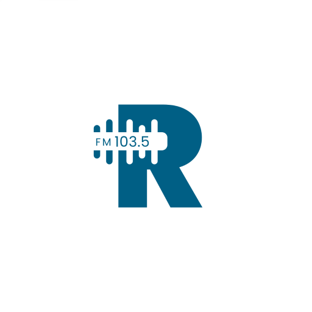

# 📻 Rádio Câmara Sete Lagoas

<div align="center">
  
  
  [](https://expo.dev)
  [](https://reactnative.dev)
  [](https://www.typescriptlang.org)
  [](LICENSE)
</div>

## 🎯 Sobre o Projeto

Aplicativo oficial da Rádio Câmara Sete Lagoas, desenvolvido para proporcionar acesso fácil e rápido às transmissões ao vivo das sessões legislativas e programas institucionais da Câmara Municipal.

### 📱 Versão Atual
- **Versão**: 1.0.2
- **Version Code**: 7
- **Última Atualização**: 15/05/2025

## ✨ Funcionalidades

<div align="center">
  <table>
    <tr>
      <td align="center">
        
        <br/>
        <b>Transmissão Ao Vivo</b>
      </td>
      <td align="center">
        
        <br/>
        <b>Reprodução em Background</b>
      </td>
      <td align="center">
        
        <br/>
        <b>Notificações</b>
      </td>
    </tr>
    <tr>
      <td align="center">
        
        <br/>
        <b>Controles de Áudio</b>
      </td>
      <td align="center">
        
        <br/>
        <b>Acessibilidade</b>
      </td>
      <td align="center">
        
        <br/>
        <b>Suporte Técnico</b>
      </td>
    </tr>
  </table>
</div>

## 🛠️ Tecnologias

- **Expo SDK 52**
- **React Native 0.76.9**
- **TypeScript 5.3.0**
- **Expo AV** (Streaming)
- **React Navigation** (Navegação)
- **React Native Reanimated** (Animações)

## 🚀 Começando

### Pré-requisitos
- Node.js 18.x ou superior
- npm 9.x ou superior
- Expo CLI
- Android Studio (para build nativo)

### Instalação

```bash
# Clone o repositório
git clone https://github.com/cm7/radio-camara-sete-lagoas.git

# Instale as dependências
npm install

# Inicie o app
npx expo start
```

## 📱 Screenshots

<div align="center">
  
  
  
</div>

## 📦 Estrutura do Projeto

```
radio-camara-app/
├── app/                    # Rotas e telas (expo-router)
├── components/            # Componentes UI
├── hooks/                # Hooks personalizados
├── context/             # Contextos React
├── constants/           # Configurações
├── types/              # Definições de tipos
└── assets/            # Recursos estáticos
```

## 📚 Documentação

Para informações técnicas detalhadas, consulte o arquivo [DOCUMENTACAO.md](./DOCUMENTACAO.md) que contém:
- Configurações técnicas
- Processos de build
- Otimizações
- Limitações conhecidas

## ⚠️ Importante

NUNCA altere estes elementos:
1. **Package Name**: `com.cm7.radiocamara`
2. **Chave de Assinatura**: Gerada pelo EAS
3. **Version Code**: Sempre incrementar

## 📞 Suporte

<div align="center">
  <table>
    <tr>
      <td align="center">
        <b>E-mail</b><br/>
        rodrigo.cpd@camarasete.mg.gov.br
      </td>
      <td align="center">
        <b>WhatsApp</b><br/>
        (31) 98634-0773
      </td>
      <td align="center">
        <b>Horário</b><br/>
        Segunda a Sexta<br/>
        8h às 17h
      </td>
    </tr>
  </table>
</div>

## 🔗 Links Úteis

- [Site Oficial da Câmara](https://www.camarasete.mg.gov.br)
- [Play Store](link-para-play-store) (em breve)
- [Documentação Expo](https://docs.expo.dev)
- [Documentação Expo AV](https://docs.expo.dev/versions/latest/sdk/audio/)

## 📝 Licença

Este projeto está sob a licença [MIT](LICENSE).

## 🤝 Contribuição

Contribuições são bem-vindas! Por favor, leia as diretrizes de contribuição antes de enviar um pull request.

---

<div align="center">
  
  <br/>
  <sub>Desenvolvido com ❤️ pela equipe de TI da Câmara Municipal de Sete Lagoas</sub>
</div> 