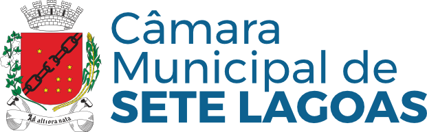

# 

[](https://expo.dev)
[](https://reactnative.dev)
[](https://www.typescriptlang.org)
[](https://play.google.com/store/apps/details?id=com.cm7.radiocamara)

Aplicativo oficial da Rádio Câmara Sete Lagoas, desenvolvido com React Native e Expo. Este aplicativo permite que os cidadãos acompanhem as transmissões ao vivo da Câmara Municipal de Sete Lagoas, com recursos avançados de streaming de áudio e notificações.

## 🚀 Funcionalidades

- 📻 Streaming de áudio em tempo real
- 🔔 Notificações de transmissões
- 🌙 Modo escuro automático
- 🔄 Reprodução em background
- 📱 Interface adaptativa
- 🔋 Otimização de bateria
- 🎧 Suporte a fones de ouvido
- 🚗 Modo carro

## 🛠️ Tecnologias

- [Expo](https://expo.dev) - Framework para desenvolvimento mobile
- [React Native](https://reactnative.dev) - Framework UI
- [TypeScript](https://www.typescriptlang.org) - Tipagem estática
- [expo-av](https://docs.expo.dev/versions/latest/sdk/audio/) - Streaming de áudio
- [expo-notifications](https://docs.expo.dev/versions/latest/sdk/notifications/) - Notificações push

## 📱 Requisitos

- Android 7.0 ou superior
- Conexão com internet
- Permissões de notificação
- Permissões de áudio

## 🚀 Instalação

1. Clone o repositório:
```bash
git clone https://github.com/cm7/radio-camara-app.git
cd radio-camara-app
```

2. Instale as dependências:
```bash
npm install
```

3. Execute o aplicativo:
```bash
npm run android
```

## 🏗️ Estrutura do Projeto

```
radio-camara-app/
├── app/                 # Telas do aplicativo
├── assets/             # Recursos estáticos
├── components/         # Componentes reutilizáveis
├── constants/          # Constantes e configurações
├── hooks/             # Hooks personalizados
├── services/          # Serviços (Foreground, etc)
└── utils/             # Funções utilitárias
```

## 🔧 Configuração de Desenvolvimento

1. Instale o [Node.js](https://nodejs.org)
2. Instale o [Expo CLI](https://docs.expo.dev/get-started/installation/)
3. Configure o [Android Studio](https://developer.android.com/studio)
4. Instale o [EAS CLI](https://docs.expo.dev/build/introduction/)

## 📦 Build

### Desenvolvimento
```bash
npm run android
```

### Produção
```bash
eas build --platform android --profile production
```

## 📄 Licença

Este projeto é propriedade da Câmara Municipal de Sete Lagoas. Todos os direitos reservados.

## 🤝 Contribuição

Para contribuir com o projeto:

1. Faça um fork do repositório
2. Crie uma branch para sua feature (`git checkout -b feature/AmazingFeature`)
3. Commit suas mudanças (`git commit -m 'Add some AmazingFeature'`)
4. Push para a branch (`git push origin feature/AmazingFeature`)
5. Abra um Pull Request

## 📞 Suporte

Para suporte técnico ou dúvidas sobre o projeto, entre em contato com a equipe de desenvolvimento da Câmara Municipal de Sete Lagoas.

## 📱 Download

[](https://play.google.com/store/apps/details?id=com.cm7.radiocamara)

---

Desenvolvido com ❤️ pela equipe de TI da Câmara Municipal de Sete Lagoas 